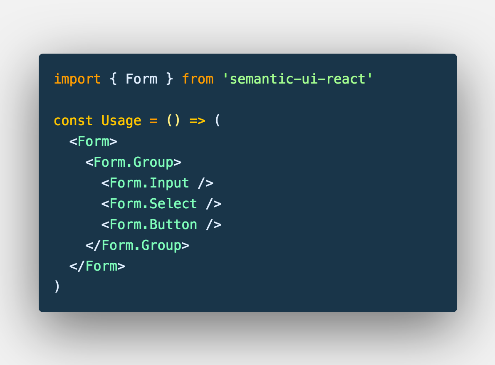

import { themes } from 'mdx-deck'
import { LiveCode } from 'mdx-deck-live-code';

export const theme = themes.dark

# React Patterns

---


```jsx

export default class Switch extends React.Component { 
  state = { 
    toggle: false 
  } 

  toggle = () => {  
    this.setState({ isSwitchOn: !this.state.isSwitchOn }); 
  } 

  render() {  
    return ( 
      <div> 
        <button onClick={this.toggle} />  
      </div>  
    ) 
  } 
} 

```

---

> Because this.props and this.state may be updated asynchronously, you should not rely on their values for calculating the next state.

---

## State updater function to Rescue!!

```jsx

export default class Switch extends React.Component { 
  state = { 
    toggle: false 
  } 

  toggle = () => {  
    this.setState(({ toggle }) => ({ toggle: !toggle })); 
  } 

  render() {  
    return ( 
      <div> 
        <button onClick={this.toggle} />  
      </div>  
    ) 
  } 
} 

```

[For deeper understanding - read this](https://medium.com/@wisecobbler/using-a-function-in-setstate-instead-of-an-object-1f5cfd6e55d1)

---

```jsx
<div>
  <Messages messages={messages} />
  <Input value={currentMessage} onChange={this.updateCurrentMessage} />
  <Button onClick={this.add} />
</div>
```

---

## Semantic UI

<div style={{
  maxWidth: '60vw',
}}>
  
</div>

---

## Example of Compound Component

```jsx
<select onChange={this.select}>
  <option value="whatever"> Whatever </option>
</select>
```

---

`static` properties

`React.Children.Map`

`React.cloneElement`

---

## For further reading

[For further reading on Compound Components](https://www.jakewiesler.com/blog/compound-component-basics/)

--- 
